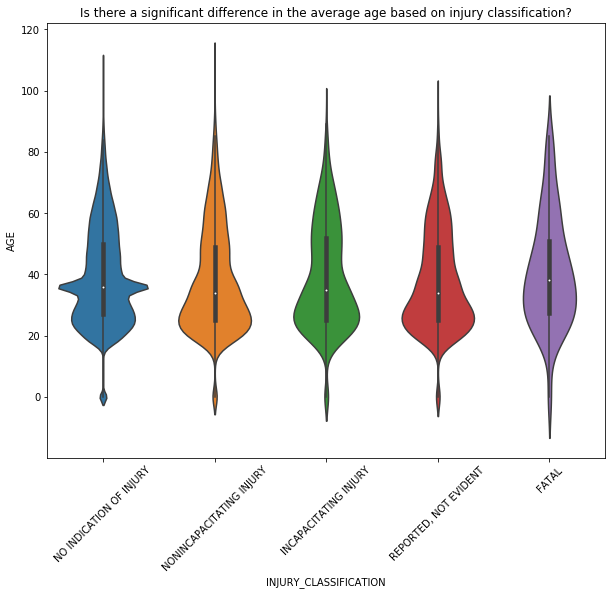
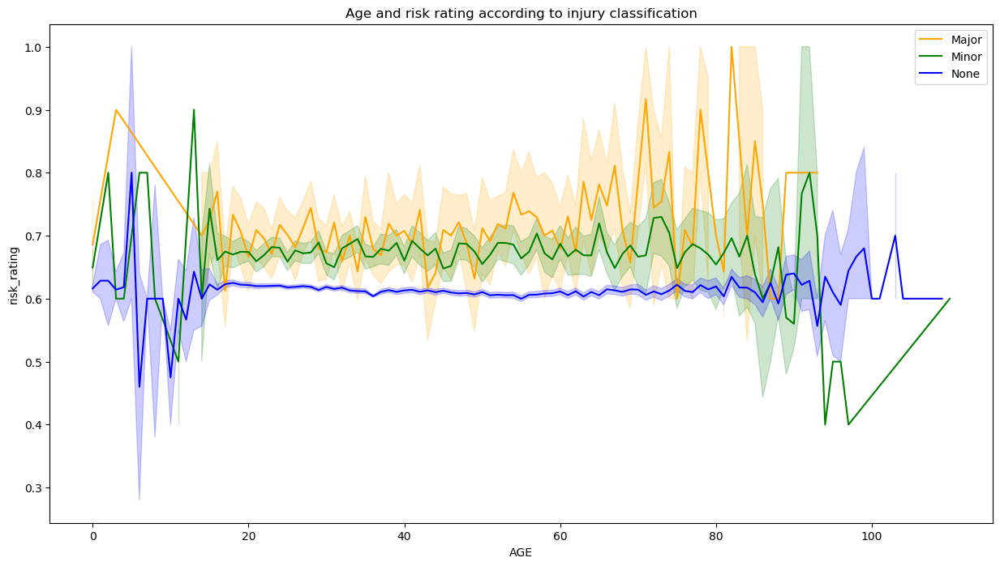
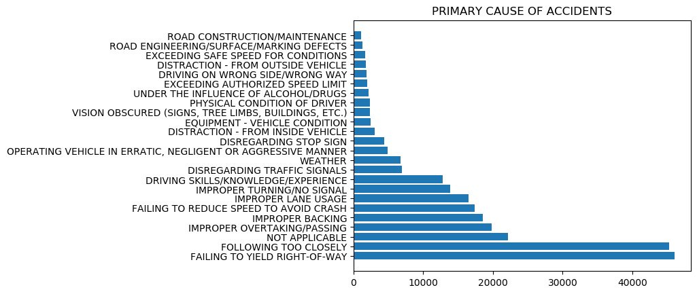
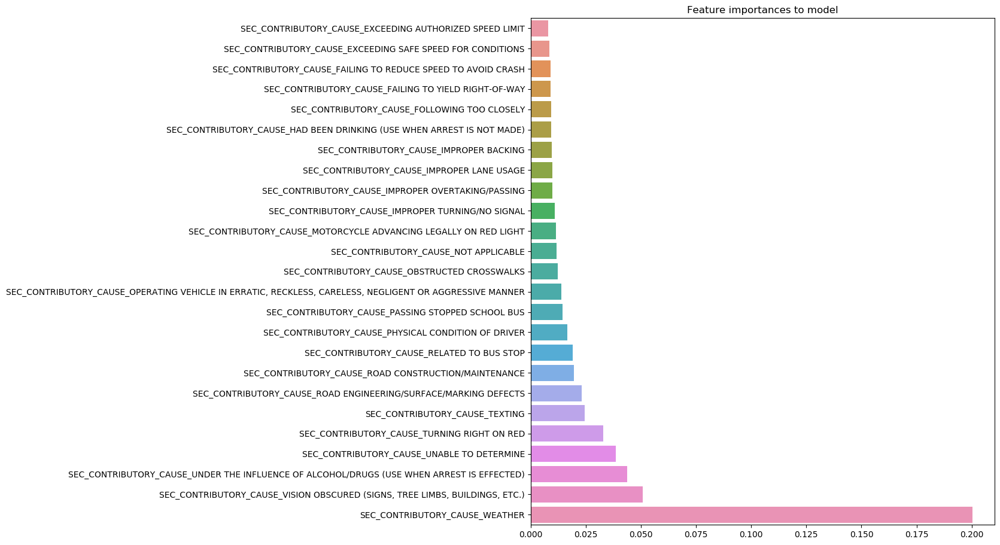

# What factors of car accident contribute to different injury outcomes?

Primarily focused on interpretability


## The area's in which we look to address are:

1. How can this be used in the outside world?
2. What does the statistical techniques conclude about our data?
3. Feature engineering
4. What did the visualizations tell about our data?
5. What features did we use?
6. Evaluation metric
7. What model was best fit?

## How can this be used in the outside world?

Seeing what factors create the most severe injury

Emergency services predicting how severe an injury might be

Creating more precautions for drivers


## Gathered Data 
Gathered Traffic Crashes dataset from Chicago data portal. We started with over 400,000 observations and 79 features


## What does the statistical techniques conclude about our data?


```python
from IPython.display import Image
```

### Anova test
Test whether there is a statistically significant difference in the average age based on their injury classification
- H0: The average age between different injury classes are all the same
- HA: The average age between different injury classes are not the same

P-value was less than 0.05 so we rejected the null. Then we looked further into the data and found that people between their 20's to 40 are most likely to get an incapitating injury or fatal.


```python
Image(filename= "violin.png")
```





### Chi Squared

Is the type of injury independent of the crash type?
- H0: injury is independent of crash type
- HA: injury is not independent of crash type

Critical Value: 88.25
Test Stat: 8326.25 

We reject the null. We then further explored and found that the most leathel car accidents are ones that you run into a fixed object

## Feature Engineering

Created a feature called 'Risk rating'. To make this feature we used the 'Primary cause of accident' feature and assigned a risk rating between 0-5 to them based of their proportion to classes of injuries. However, this did not help our model therefore we decided to drop it.


## What did the visualizations tell about our data?


The graph below shows that the risk exposure to a certain classification based on age group

Each line represents the classes of Major, Minor, and No injury

Notable proportion of senior citizens and young children engaged in high risk cause of accidents leading to to major injuries


```python
Image(filename= "line.png")
```





Below shows the primary cause of accidents

The two most common primary accident causes are following too closely and failing to yield right of way


```python
Image(filename= "fig.png")
```





## What features did we use?
Independent variables: PERSON_TYPE, SEX, AGE, SAFETY_EQUIPMENT, AIRBAG_DEPLOYED, EJECTION, DRIVER_ACTION, DRIVER_VISION, PHYSICAL_CONDITION, BAC_RESULT, POSTED_SPEED_LIMIT, TRAFFIC_CONTROL_DEVICE, DEVICE_CONDITION, WEATHER_CONDITION, LIGHTING_CONDITION, FIRST_CRASH_TYPE, TRAFFICWAY_TYPE, ROADWAY_SURFACE_COND, ROAD_DEFECT, CRASH_TYPE, DAMAGE, PRIM_CONTRIBUTORY_CAUSE, SEC_CONTRIBUTORY_CAUSE, CRASH_HOUR, CRASH_DAY_OF_WEEK, CRASH_MONTH, prim, risk_rating

Dependent Variable: INJURY_CLASSIFICATION

We divided 'INJURY_CLASSIFICATION' into Major:2, Minor:1, and No injury:0.

## Evaluation Metric

We decided to use the Macro F-1 score and accuracy rating. We primarily focused on Macro F-1 score because it represents the relationship between precision and recall for all three classes. The higher it is the higher all three classes are being predicted well.

## What model was best fit?

### Best Model: Random Forest customized class balance

How did we handle class imbalance?
Balanced all three classes into 20,000 observations for the training set.

Why did we choose Random Forest?
Best handled multiclass problems. It also reduces the variance and bias, which we are exposed to due to the class imbalance in our classes.

Results: F-1 Macro is .745 and accuracy score is 0.884

List of our most important features to our best model is below.


```python
Image(filename= "features.png")
```





## Conclusions and Recommendations

Overall, our purpose of our project is intended for interpretation. We found that based on the data senior and young citizens, the weather condition, and running into fixed objects will cause a higher risk of major injury. Vice versa for minor and no injury. Next time we do this project we would like to explore webscrapping zip code related data and the relations between the season and target variable.
